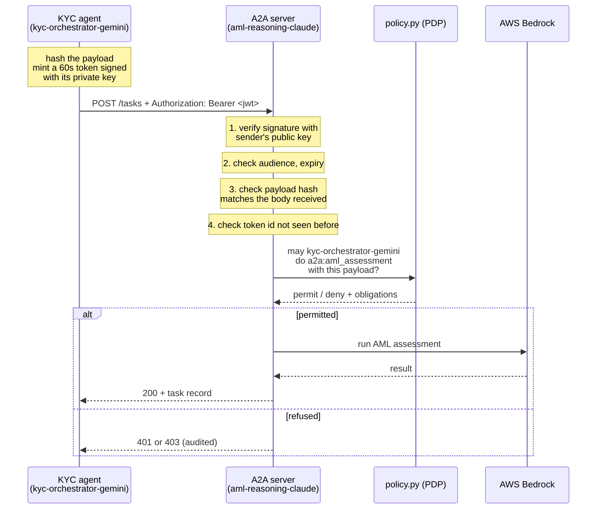

# Design notes: authorisation in an agentic system

This document explains why the authorisation layer in this repository is built
the way it is. It is written to be read start to finish, and to answer the
question "why did you do it that way?" for each decision.

---

## 1. The thesis in one sentence

An agentic system has two boundaries where something can go wrong (an agent
calling a tool, and an agent calling another agent), and both are the same
question, *may this principal perform this action on this resource?*, so both
should be answered by the same policy engine rather than by ad-hoc checks.

---

## 2. The two boundaries

```
                    +---------------------------+
                    |  google_agent.py          |
                    |  KYC orchestrator         |
                    |  identity: kyc-           |
                    |  orchestrator-gemini      |
                    +------+-------------+------+
                           |             |
        BOUNDARY 1         |             |         BOUNDARY 2
        agent -> tool      |             |         agent -> agent
        (MCP, stdio)       |             |         (A2A, HTTP)
                           v             v
              +-----------------+   +------------------+
              | mcp_server.py   |   | a2a_server.py    |
              | PEP #1          |   | PEP #2           |
              +--------+--------+   +---------+--------+
                       |                      |
                       |   both ask the same  |
                       +----------+-----------+
                                  v
                       +---------------------+
                       |  policy.py          |
                       |  PDP                |
                       |  default-deny ABAC  |
                       +---------------------+
                                  |
              +-------------------+------------------+
              v                                      v
      7 compliance tools                    AWS Bedrock AML agent
```

**PDP** is the Policy Decision Point: it decides, and does nothing else.
**PEP** is the Policy Enforcement Point: it asks the PDP and obeys the answer.
**PAP** is the Policy Administration Point: the rules themselves, kept as data.

Separating them matters because it means policy can be reviewed, tested and
changed without touching enforcement code, and enforcement can be added at a new
boundary without reimplementing the rules.

---

## 3. Boundary 1: agent to tool

### What was wrong before

`google_agent.py` imported six functions and called them directly in a fixed
order. Nothing checked whether a call was permitted, because in a single script
the question does not arise. As soon as a model chooses the calls, it does.

### What it does now

Every tool call travels over MCP to `mcp_server.py`, whose single `call_tool`
handler is the only path to any tool. That handler asks `policy.evaluate` before
executing anything.

### Design decisions and their reasons

**Enforcement lives with the resource, not the caller.** The agent also runs the
policy check locally, but only to avoid a pointless round trip. If the agent's
check were the only one, then a bug, a prompt injection, or a modified client
would bypass it entirely. Controls belong on the side that owns the thing being
protected.

**Default is deny.** A tool with no matching rule is refused. If someone adds an
eighth tool tomorrow and forgets to write a rule, it is inert rather than open.
Failing closed is the correct posture when the resources are sanctions screening
and identity documents.

**Automatic function calling is disabled in the SDK.** The google-genai library
will execute Python functions for you. That convenience would route calls around
the enforcement point, so it is switched off and every call is dispatched
manually through the MCP client.

**Authorisation looks at arguments, not just callers.** The vision tool's rule
requires `image_path` to resolve inside `data/`, checked with `realpath` so that
`../` sequences and symlinks cannot escape. This is the difference between RBAC
(who are you) and ABAC (who are you, what are you touching, under what
conditions).

**Permitted calls can carry obligations.** The vision rule attaches
`pii_scan_required` and `no_image_retention`, which the enforcement point
actions. An obligation is a condition of the permission, not advice.

**Denials are audited, not dropped.** A refused call is a security event. The
enforcement point writes an audit entry for every attempt, before the tool runs,
so the compliance record does not depend on the model choosing to log anything.

---

## 4. Boundary 2: agent to agent

### What was wrong before

```
POST /tasks
{
  "sender_agent_id": "kyc-orchestrator-gemini",     <-- just a string
  "payload": { ...customer data... }
}
```

The receiving agent read the caller's identity out of the request body and ran a
Bedrock inference. Anything that could reach the port could claim to be the KYC
orchestrator. Identity was **asserted**, not **proved**, and nothing checked
whether that caller was allowed to delegate this kind of work.

### What it does now



### Design decisions and their reasons

**Prove identity with a signature instead of reading a field.** The caller mints
a JSON Web Token signed with its own private key. The receiver derives identity
from the verified token and ignores `sender_agent_id` in the body entirely. That
field is still recorded, so a mismatch between what a caller claimed and what it
proved appears in the audit log.

**Asymmetric signing (RS256), not a shared secret (HS256).** With a shared
secret, anyone who can verify a token can also mint one, so the receiving agent
would hold a key capable of impersonating the sender. With a keypair, the
receiver holds only a public key: it can check a signature but cannot produce
one. Compromising the receiver does not let an attacker forge the sender's
identity.

**The algorithm is pinned.** Verification specifies `algorithms=["RS256"]`. Left
open, a token claiming `alg: none` or `alg: HS256` can trick some libraries into
skipping verification or treating the public key as a shared secret. This is a
well-known JWT attack class and the fix is one argument.

**The token is bound to the payload.** A bearer token is usable by whoever holds
it. Without binding, a token captured from a log or the network is valid against
*any* body for its whole lifetime, so an attacker could keep the token and
substitute a different customer's data. The `pbh` claim carries a SHA-256 of the
canonical JSON body; change one byte and verification fails.

**Sixty-second expiry plus a replay cache.** Expiry bounds how long a leaked
token is useful. Recording the `jti` (unique token id) until it expires means a
token cannot be used twice even inside that window. Together they reduce a
captured credential from "reusable access" to "at most one lost request".

**Audience is checked.** The `aud` claim names the intended receiver, so a token
minted for one agent cannot be replayed against another agent that trusts the
same signer.

**Scope is checked before policy.** The token states what it is asking for. A
token minted for a different scope is refused at the door, before any policy
lookup, because presenting the wrong credential is a cheaper thing to detect.

**Identity resolves to a role through an agent registry.** `policy.py` maps a
verified agent id to a role. An agent absent from the registry gets a role that
no rule grants anything to, so it is refused by default rather than raising an
error. In production this registry is the agent catalogue.

**The policy check enforces data minimisation.** The delegation rule allows only
the eleven assessment fields to cross the boundary. If the KYC agent attaches
the customer's address, income or document image, the request is refused. The
receiving agent should get what its task needs and nothing more, and that is an
authorisation decision, not a code review convention.

**Task reads are authenticated too.** `GET /tasks/<id>` returns a record
containing the customer assessment, and only the submitting agent may read it. A
UUID is unguessable, but an unguessable identifier is not an access control.

**Health and agent-card stay open, deliberately.** A capability card is how
another agent discovers how to talk to this one, including how to authenticate,
so it cannot itself require authentication. Neither endpoint discloses customer
data, and health reports only liveness and a task count.

**The pipeline fails closed when the AML agent is unavailable.** The orchestrator
previously fell back to calling the AML function in-process if the A2A server was
unreachable: no token, no policy check, no audit entry. That is fail-open, and it
means a network error disables the boundary. The fallback is gone, and so is the
import that made it possible, so the capability no longer exists in that file
rather than merely being unused. A refused delegation is terminal for the same
reason: continuing with an empty AML result would produce a compliance decision
with a hole where the reasoning should be.

**Auth errors are terse to the caller, detailed in the log.** Telling an
attacker exactly which check failed helps them tune the next attempt. The audit
record keeps the full reason.

---

## 5. What each control actually stops

| Attack | Control that stops it | Result |
|---|---|---|
| Claim to be the KYC agent with no credential | Bearer token required | 401 |
| Claim to be the KYC agent, sign with your own key | Signature checked against the real agent's public key | 401 |
| Sign correctly as an agent nobody knows | No public key on file for that issuer | 401 |
| Reuse a token found in a log an hour later | 60-second expiry | 401 |
| Reuse a token minted for a different agent | Audience check | 401 |
| Keep a valid token, swap in another customer's data | Payload binding (`pbh`) | 401 |
| Capture a token in flight and send it again | Replay cache (`jti`) | 401 |
| Genuine agent, but asking for a different action | Scope check | 403 |
| Genuine agent forwarding the customer's full record | Data-minimisation condition in policy | 403 |
| Genuine agent reading another agent's task | Submitter check on `GET /tasks/<id>` | 403 |
| Take the A2A server offline to skip the boundary | No in-process fallback path exists | Pipeline halts |

All ten are covered by `tests/test_a2a_authorisation.py`, which generates
ephemeral keys in memory and needs no cloud credentials.

---

## 6. Questions you are likely to be asked

**"Isn't a JWT overkill for two local processes?"**
For two local processes, yes. The reason to build it is that the interesting
version of this system has many agents, some operated by other teams, and at
that point "the caller told us who it was" is not a control. The pattern is what
matters; the transport is incidental.

**"Where do the keys come from?"**
Generated locally on first run into a gitignored directory. No private key is
committed, and the tests generate their own in memory so a clean clone passes
with no setup. In production the calling workload's identity would come from the
platform (a Kubernetes service account token, cloud workload identity, or an
OAuth 2.1 client-credentials grant), and public keys would be discovered through
a JWKS endpoint rather than read from a file.

**"Why not mTLS?"**
mTLS authenticates the transport, which is the right layer for machine-to-machine
trust and would be a sensible addition. It does not carry the scope of a request
or bind to a payload, so a token still does work that a certificate does not. In
practice you would use both: mTLS for the channel, a token for the request.

**"Your replay cache is in-process. What happens with three replicas?"**
It breaks: a token rejected by one replica would be accepted by another. Shared
state (Redis, or a database with a uniqueness constraint on `jti`) is the
production answer. Named as a known gap rather than hidden.

**"You disabled the SDK's automatic function calling. Why make life harder?"**
Because the convenient path executed tools without passing through the
enforcement point. A control that a library can silently route around is not a
control.

**"The model didn't always call the audit tool. Isn't that a compliance problem?"**
It would be if the compliance record depended on it. It does not: the enforcement
point writes an entry for every tool call, authorised or denied, before the tool
runs. The model's own audit calls are discretionary business-event logging on
top of a mandatory record it cannot skip.

**"What happens if the AML agent is down?"**
The pipeline stops and reports which stage failed. It used to fall back to an
in-process call, which quietly bypassed authorisation whenever the server was
unreachable. Availability is a real cost of failing closed, and the right answer
for a compliance decision: no answer beats an unauthorised one.

**"What is the cost of all this?"**
Latency and complexity. A standard assessment takes eight to ten seconds; one
that escalates to vision analysis takes around fifty-five. Every tool call now
crosses a process boundary and a policy check. For a prototype demonstrating
governance that is the right trade; for a high-volume onboarding flow you would
want the policy decision cached and the vision path made asynchronous.

---

## 7. Known gaps

Stated plainly, because a design that hides its edges is harder to trust than one
that names them.

- **Replay cache is in-process**, so it does not survive a restart or work across
  replicas.
- **No key rotation and no revocation.** A compromised key is valid until someone
  edits a file. Production needs rotation, and short-lived platform-issued
  credentials rather than long-lived local keys.
- **Delegation chains are not modelled.** If the AML agent called a third agent,
  nothing would carry the fact that it is acting on behalf of the KYC agent's
  case. Real delegation needs the chain in the token (an actor claim) and policy
  that reasons about it.
- **Tool discovery is not filtered per principal.** Execution is gated; listing
  is not, so every identity sees all seven tools.
- **No rate limiting** on either boundary.
- **The A2A transport is plain HTTP on localhost.** TLS is assumed to be
  terminated elsewhere, which is fine for a prototype and not a claim about
  production.
